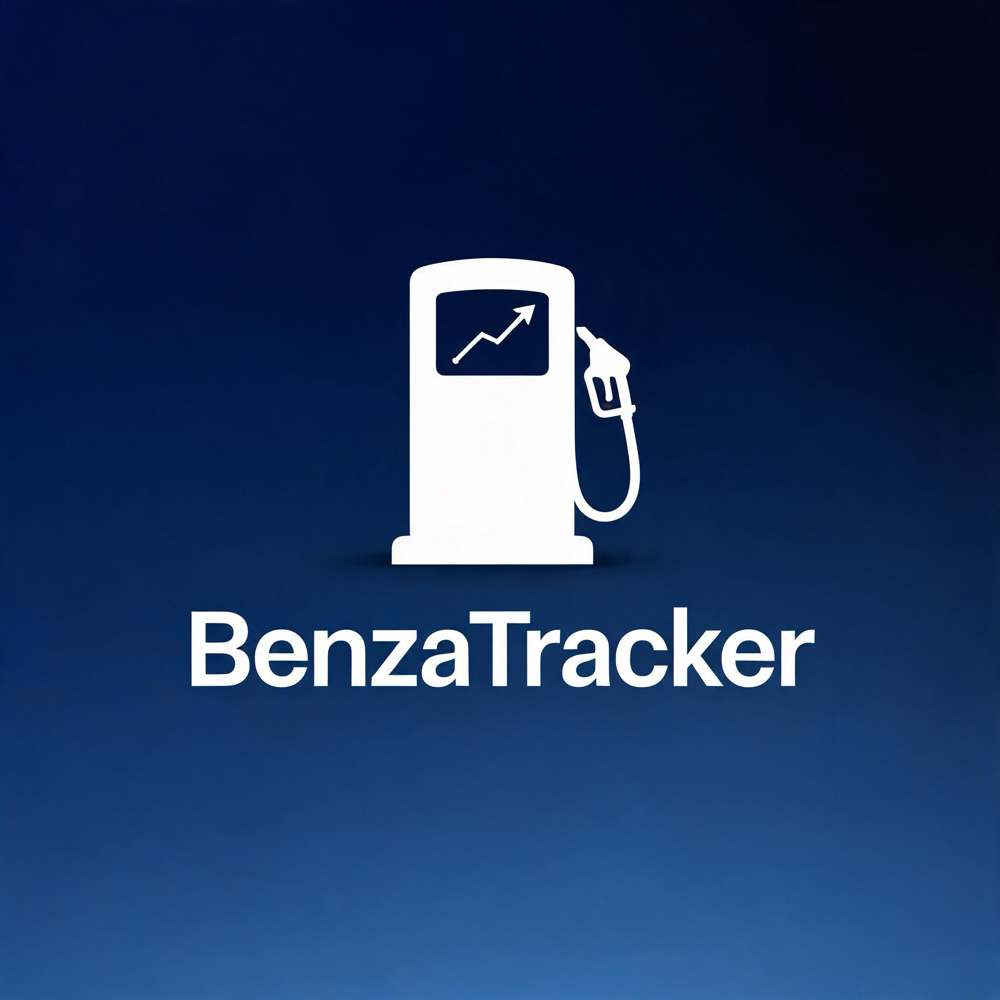

# BenzaTracker

<p align="center">
  
</p>

<p align="center">
  <a href="https://github.com/FrancescoCastaldi/BenzaTracker/actions/workflows/python-app.yml">
    
  </a>
  <a href="https://www.python.org/">
    
  </a>
  <a href="LICENSE">
    
  </a>
  <a href="https://docs.astral.sh/ruff/">
    
  </a>
  <a href="https://github.com/FrancescoCastaldi/BenzaTracker/pulls">
    
  </a>
</p>

> Desktop and CLI application to track fuel refuels, compute spending KPIs and export PDF reports.

---

## ✨ Features

| Feature | Description |
|---|---|
| 📋 **Refuel logging** | Date, liters, amount paid, price per liter and station name |
| 📊 **KPI dashboard** | Total spent, total liters, average price, monthly average |
| 📈 **Monthly chart** | Interactive bar chart of monthly spending via matplotlib |
| 📄 **PDF export** | Full report with table and chart via ReportLab |
| 💾 **Local persistence** | `~/.benzatracker/refuels.json` with **atomic write** (crash-safe) |
| 🖥️ **GUI + CLI** | ttkbootstrap graphical interface and plain-text fallback |

---

## 🚀 Installation

### Prerequisites

- Python **3.10** or higher
- `pip`

### macOS / Linux

```bash
git clone https://github.com/FrancescoCastaldi/BenzaTracker.git
cd BenzaTracker
python3 -m venv .venv
source .venv/bin/activate
pip install -r requirements.txt
```

### Windows

```bat
git clone https://github.com/FrancescoCastaldi/BenzaTracker.git
cd BenzaTracker
install_and_run.bat
```

---

## ▶️ Usage

### Graphical interface

```bash
python -m benzatracker.gui
# or
python main.py
```

### Command-line interface

```bash
python -m benzatracker.cli
```

---

## 🧪 Tests

```bash
pip install pytest
pytest
```

Tests cover `DataStore`, `KPI` calculations and the CLI flow on Windows.

---

## 🗂 Project structure

```
BenzaTracker/
├── main.py                    # GUI entry point
├── requirements.txt           # Runtime dependencies
├── pyproject.toml             # Project metadata + ruff/mypy config
├── pytest.ini                 # Pytest configuration
├── install_and_run.bat        # Windows installer
├── docs/
│   └── logo.jpg               # App logo
├── benzatracker/
│   ├── __init__.py
│   ├── data_store.py          # Persistence (atomic write + validation)
│   ├── kpi.py                 # KPI computation and aggregations
│   ├── cli.py                 # Command-line interface
│   ├── gui.py                 # ttkbootstrap graphical interface
│   └── pdf_report.py          # PDF export via ReportLab
└── tests/
    ├── test_data_store.py
    ├── test_kpi.py
    └── test_cli_windows.py
```

---

## 🤝 Contributing

1. Fork the repository
2. Create a branch: `git checkout -b feat/your-feature`
3. Commit using [Conventional Commits](https://www.conventionalcommits.org/): `feat:`, `fix:`, `refactor:`
4. Open a Pull Request describing your changes

```bash
# Optional but recommended: set up pre-commit hooks
pip install pre-commit
pre-commit install
```

---

## 📜 Changelog

See [CHANGELOG.md](CHANGELOG.md) for the full version history.

---

## 📄 License

Distributed under the **MIT** license. See [LICENSE](LICENSE) for details.
